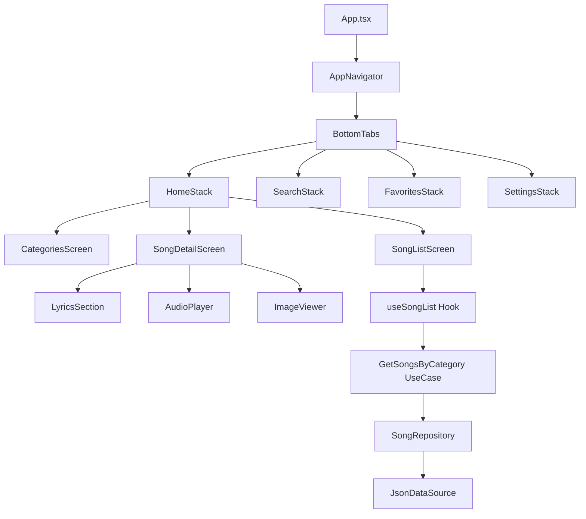

# 🏗️ Arquitetura do Sistema

## 1. Visão Geral da Arquitetura

O projeto segue os princípios de **Clean Architecture** combinado com **Feature-Sliced Design**, garantindo:

- ✅ Separação clara de responsabilidades
- ✅ Testabilidade
- ✅ Manutenibilidade
- ✅ Escalabilidade
- ✅ Independência de frameworks

---

## 2. Camadas da Arquitetura

```
┌─────────────────────────────────────────────┐
│         PRESENTATION LAYER                  │
│   (UI, Components, Screens, State)          │
├─────────────────────────────────────────────┤
│         DOMAIN LAYER                        │
│   (Entities, Use Cases, Business Logic)     │
├─────────────────────────────────────────────┤
│         DATA LAYER                          │
│   (Repositories, Data Sources, DTOs)        │
├─────────────────────────────────────────────┤
│         INFRASTRUCTURE LAYER                │
│   (Storage, Audio Player, File System)      │
└─────────────────────────────────────────────┘
```

### 2.1 Presentation Layer (UI)

**Responsabilidades:**
- Componentes visuais (React Native)
- Gerenciamento de estado local (useState, useReducer)
- Navegação entre telas
- Interação com usuário

**Padrões:**
- Smart Components (containers)
- Dumb Components (presentational)
- Custom Hooks para lógica reutilizável

### 2.2 Domain Layer (Core)

**Responsabilidades:**
- Entidades de negócio
- Use Cases (casos de uso)
- Regras de negócio puras
- Interfaces de repositórios

**Características:**
- ✅ Sem dependências externas
- ✅ Puramente TypeScript
- ✅ 100% testável

### 2.3 Data Layer

**Responsabilidades:**
- Implementação de repositórios
- Acesso aos dados (JSON local, AsyncStorage)
- Transformação de dados (DTO ↔ Entity)
- Cache strategies

### 2.4 Infrastructure Layer

**Responsabilidades:**
- Implementações técnicas (Expo AV, FileSystem, etc.)
- Adaptadores para bibliotecas externas
- Configurações de ambiente

---

## 3. Estrutura de Pastas Detalhada

```
app-react-native/
│
├── 📁 src/
│   │
│   ├── 📁 core/                          # DOMAIN LAYER
│   │   ├── 📁 entities/                  # Modelos de domínio
│   │   │   ├── Song.ts                   # Entidade Canto
│   │   │   ├── Category.ts               # Entidade Categoria
│   │   │   ├── Chord.ts                  # Entidade Acorde
│   │   │   └── Verse.ts                  # Entidade Estrofe
│   │   │
│   │   ├── 📁 use-cases/                 # Casos de uso
│   │   │   ├── songs/
│   │   │   │   ├── GetSongsByCategory.ts
│   │   │   │   ├── GetSongById.ts
│   │   │   │   ├── SearchSongs.ts
│   │   │   │   └── ToggleFavorite.ts
│   │   │   │
│   │   │   ├── audio/
│   │   │   │   ├── PlayAudio.ts
│   │   │   │   ├── PauseAudio.ts
│   │   │   │   └── SeekAudio.ts
│   │   │   │
│   │   │   └── favorites/
│   │   │       ├── GetFavorites.ts
│   │   │       └── SyncFavorites.ts
│   │   │
│   │   └── 📁 repositories/              # Interfaces dos repositórios
│   │       ├── ISongRepository.ts
│   │       ├── IFavoriteRepository.ts
│   │       └── IAudioRepository.ts
│   │
│   ├── 📁 data/                          # DATA LAYER
│   │   ├── 📁 repositories/              # Implementações
│   │   │   ├── SongRepository.ts
│   │   │   ├── FavoriteRepository.ts
│   │   │   └── AudioRepository.ts
│   │   │
│   │   ├── 📁 datasources/               # Fontes de dados
│   │   │   ├── local/
│   │   │   │   ├── JsonDataSource.ts     # Leitura de JSONs
│   │   │   │   ├── StorageDataSource.ts  # AsyncStorage
│   │   │   │   └── AssetDataSource.ts    # Áudios/Imagens
│   │   │   │
│   │   │   └── cache/
│   │   │       └── SongCacheManager.ts
│   │   │
│   │   ├── 📁 models/                    # DTOs (Data Transfer Objects)
│   │   │   ├── SongDTO.ts
│   │   │   └── CategoryDTO.ts
│   │   │
│   │   └── 📁 mappers/                   # Conversores DTO ↔ Entity
│   │       └── SongMapper.ts
│   │
│   ├── 📁 presentation/                  # PRESENTATION LAYER
│   │   │
│   │   ├── 📁 screens/                   # Telas principais
│   │   │   ├── 📁 home/
│   │   │   │   ├── HomeScreen.tsx
│   │   │   │   ├── components/
│   │   │   │   │   ├── CategoryCard.tsx
│   │   │   │   │   └── CategoryGrid.tsx
│   │   │   │   └── hooks/
│   │   │   │       └── useCategories.ts
│   │   │   │
│   │   │   ├── 📁 song-list/
│   │   │   │   ├── SongListScreen.tsx
│   │   │   │   ├── components/
│   │   │   │   │   ├── SongListItem.tsx
│   │   │   │   │   └── EmptyState.tsx
│   │   │   │   └── hooks/
│   │   │   │       └── useSongList.ts
│   │   │   │
│   │   │   ├── 📁 song-detail/
│   │   │   │   ├── SongDetailScreen.tsx
│   │   │   │   ├── components/
│   │   │   │   │   ├── LyricsSection.tsx
│   │   │   │   │   ├── ChordsDisplay.tsx
│   │   │   │   │   ├── AudioPlayer.tsx
│   │   │   │   │   └── ImageViewer.tsx
│   │   │   │   └── hooks/
│   │   │   │       ├── useSongDetail.ts
│   │   │   │       └── useAudioPlayer.ts
│   │   │   │
│   │   │   ├── 📁 search/
│   │   │   │   ├── SearchScreen.tsx
│   │   │   │   └── components/
│   │   │   │       ├── SearchBar.tsx
│   │   │   │       └── SearchResults.tsx
│   │   │   │
│   │   │   ├── 📁 favorites/
│   │   │   │   ├── FavoritesScreen.tsx
│   │   │   │   └── hooks/
│   │   │   │       └── useFavorites.ts
│   │   │   │
│   │   │   └── 📁 settings/
│   │   │       ├── SettingsScreen.tsx
│   │   │       └── components/
│   │   │           ├── ThemeSelector.tsx
│   │   │           └── FontSizeSelector.tsx
│   │   │
│   │   ├── 📁 components/                # Componentes compartilhados
│   │   │   ├── ui/                       # UI primitivos
│   │   │   │   ├── Button.tsx
│   │   │   │   ├── Card.tsx
│   │   │   │   ├── Text.tsx
│   │   │   │   ├── Icon.tsx
│   │   │   │   └── LoadingSpinner.tsx
│   │   │   │
│   │   │   ├── feedback/                 # Feedback components
│   │   │   │   ├── ErrorBoundary.tsx
│   │   │   │   ├── Toast.tsx
│   │   │   │   └── EmptyState.tsx
│   │   │   │
│   │   │   └── layout/                   # Layout components
│   │   │       ├── Screen.tsx
│   │   │       ├── Section.tsx
│   │   │       └── Header.tsx
│   │   │
│   │   ├── 📁 navigation/                # Navegação
│   │   │   ├── AppNavigator.tsx          # Root navigator
│   │   │   ├── BottomTabNavigator.tsx
│   │   │   ├── StackNavigator.tsx
│   │   │   └── types.ts                  # Tipos de navegação
│   │   │
│   │   ├── 📁 store/                     # State Management (Zustand)
│   │   │   ├── index.ts                  # Export central
│   │   │   ├── appStore.ts               # Config global
│   │   │   ├── favoritesStore.ts         # Favoritos
│   │   │   ├── audioStore.ts             # Player de áudio
│   │   │   └── searchStore.ts            # Busca
│   │   │
│   │   ├── 📁 hooks/                     # Custom Hooks globais
│   │   │   ├── useTheme.ts
│   │   │   ├── useFontSize.ts
│   │   │   ├── useDebounce.ts
│   │   │   └── useKeyboard.ts
│   │   │
│   │   └── 📁 theme/                     # Tema e estilos
│   │       ├── colors.ts
│   │       ├── typography.ts
│   │       ├── spacing.ts
│   │       └── index.ts
│   │
│   ├── 📁 infrastructure/                # INFRASTRUCTURE LAYER
│   │   ├── 📁 audio/
│   │   │   └── ExpoAudioPlayer.ts        # Adapter para Expo AV
│   │   │
│   │   ├── 📁 storage/
│   │   │   ├── AsyncStorageAdapter.ts
│   │   │   └── SecureStoreAdapter.ts
│   │   │
│   │   ├── 📁 filesystem/
│   │   │   └── AssetLoader.ts            # Carregamento de assets
│   │   │
│   │   └── 📁 search/
│   │       └── FlexSearchEngine.ts       # Implementação busca
│   │
│   └── 📁 shared/                        # Utilitários compartilhados
│       ├── 📁 utils/
│       │   ├── string.utils.ts           # Funções de string
│       │   ├── date.utils.ts             # Formatação de data
│       │   ├── file.utils.ts             # Manipulação de arquivos
│       │   └── validation.utils.ts       # Validações
│       │
│       ├── 📁 constants/
│       │   ├── categories.ts             # Categorias fixas
│       │   ├── routes.ts                 # Nomes de rotas
│       │   └── config.ts                 # Configurações
│       │
│       └── 📁 types/
│           ├── index.ts                  # Export central
│           └── common.types.ts           # Tipos compartilhados
│
├── 📁 assets/                            # Assets estáticos
│   ├── 📁 fonts/                         # Fontes customizadas
│   ├── 📁 icons/                         # Ícones do app
│   ├── 📁 images/                        # Imagens gerais
│   │   └── splash.png
│   └── 📁 data/                          # Dados locais
│       ├── 📁 songs/                     # JSONs dos cantos
│       │   ├── 📁 catecumenato/
│       │   ├── 📁 eleicao/
│       │   ├── 📁 liturgia/
│       │   └── 📁 pre-catecumenato/
│       │
│       ├── 📁 audios/                    # Arquivos MP3
│       │   ├── 📁 catecumenato/
│       │   ├── 📁 eleicao/
│       │   ├── 📁 liturgia/
│       │   └── 📁 pre-catecumenato/
│       │
│       └── 📁 sheet-music/               # Imagens das partituras
│           ├── 📁 catecumenato/
│           ├── 📁 eleicao/
│           ├── 📁 liturgia/
│           └── 📁 pre-catecumenato/
│
├── 📁 __tests__/                         # Testes
│   ├── 📁 unit/
│   │   ├── 📁 core/
│   │   └── 📁 utils/
│   │
│   ├── 📁 integration/
│   │   └── 📁 repositories/
│   │
│   └── 📁 e2e/
│       └── navigation.test.ts
│
├── 📁 docs/                              # Documentação
│   ├── REQUIREMENTS.md
│   ├── TECH_STACK.md
│   ├── ARCHITECTURE.md
│   ├── ROADMAP.md
│   └── FLOWCHARTS.md
│
├── 📄 .gitignore
├── 📄 .eslintrc.js
├── 📄 .prettierrc
├── 📄 tsconfig.json
├── 📄 tailwind.config.js
├── 📄 app.json                           # Config do Expo
├── 📄 eas.json                           # Config do EAS Build
├── 📄 package.json
├── 📄 App.tsx                            # Entry point
└── 📄 README.md
```

---

## 4. Fluxo de Dados

### 4.1 Fluxo de Leitura (Query)

```
┌──────────────┐
│    Screen    │ ← Renderiza UI
└──────┬───────┘
       │ usa
       ↓
┌──────────────┐
│  Custom Hook │ ← Gerencia estado local
└──────┬───────┘
       │ chama
       ↓
┌──────────────┐
│   Use Case   │ ← Lógica de negócio
└──────┬───────┘
       │ usa
       ↓
┌──────────────┐
│  Repository  │ ← Acessa dados
└──────┬───────┘
       │ usa
       ↓
┌──────────────┐
│ Data Source  │ ← JSON / Storage
└──────────────┘
```

**Exemplo Prático:**
```typescript
// 1. Screen
const SongListScreen = () => {
  const { songs, loading } = useSongList('catecumenato');
  
  return <SongList songs={songs} loading={loading} />;
};

// 2. Hook
const useSongList = (category: string) => {
  const [songs, setSongs] = useState([]);
  const getSongs = new GetSongsByCategory(songRepository);
  
  useEffect(() => {
    getSongs.execute(category).then(setSongs);
  }, [category]);
  
  return { songs, loading };
};

// 3. Use Case
class GetSongsByCategory {
  execute(category: string): Promise<Song[]> {
    return this.repository.findByCategory(category);
  }
}

// 4. Repository
class SongRepository implements ISongRepository {
  async findByCategory(category: string): Promise<Song[]> {
    const dtos = await this.dataSource.loadSongs(category);
    return dtos.map(SongMapper.toDomain);
  }
}
```

### 4.2 Fluxo de Escrita (Command)

```
┌──────────────┐
│    Screen    │ ← Usuário interage
└──────┬───────┘
       │ dispara ação
       ↓
┌──────────────┐
│  Zustand     │ ← Atualiza estado global
│  Store       │
└──────┬───────┘
       │ chama
       ↓
┌──────────────┐
│  Use Case    │ ← Executa lógica
└──────┬───────┘
       │ persiste
       ↓
┌──────────────┐
│  Repository  │ ← Salva dados
└──────────────┘
```

**Exemplo Prático:**
```typescript
// Store
const useFavoritesStore = create((set) => ({
  favorites: [],
  
  toggleFavorite: async (songId: string) => {
    const useCase = new ToggleFavorite(favoriteRepository);
    const result = await useCase.execute(songId);
    
    set({ favorites: result });
  },
}));

// Uso na tela
const DetailScreen = ({ songId }) => {
  const toggleFavorite = useFavoritesStore(s => s.toggleFavorite);
  
  return (
    <IconButton 
      icon="heart" 
      onPress={() => toggleFavorite(songId)} 
    />
  );
};
```

---

## 5. Padrões de Design Utilizados

### 5.1 Repository Pattern

**Objetivo:** Abstrair acesso aos dados.

**Benefícios:**
- ✅ Fácil mudança de data source
- ✅ Testável (mock repositories)
- ✅ Centraliza lógica de acesso

### 5.2 Use Case Pattern

**Objetivo:** Encapsular lógica de negócio.

**Benefícios:**
- ✅ Single Responsibility
- ✅ Reutilizável
- ✅ Testável isoladamente

### 5.3 Adapter Pattern

**Objetivo:** Adaptar interfaces de bibliotecas externas.

**Exemplo:**
```typescript
// Interface do domínio
interface IAudioPlayer {
  play(uri: string): Promise<void>;
  pause(): Promise<void>;
}

// Adapter para Expo AV
class ExpoAudioPlayer implements IAudioPlayer {
  private sound: Audio.Sound;
  
  async play(uri: string) {
    this.sound = await Audio.Sound.createAsync({ uri });
    await this.sound.playAsync();
  }
}
```

### 5.4 Mapper Pattern

**Objetivo:** Converter entre DTOs e Entities.

**Exemplo:**
```typescript
class SongMapper {
  static toDomain(dto: SongDTO): Song {
    return new Song({
      id: dto.titulo_principal.toLowerCase(),
      title: dto.titulo_principal,
      subtitle: dto.subtitulo,
      // ...
    });
  }
  
  static toDTO(entity: Song): SongDTO {
    // Conversão reversa
  }
}
```

### 5.5 Factory Pattern

**Objetivo:** Criar instâncias complexas.

**Exemplo:**
```typescript
class UseCaseFactory {
  static createGetSongs(): GetSongsByCategory {
    const dataSource = new JsonDataSource();
    const repository = new SongRepository(dataSource);
    return new GetSongsByCategory(repository);
  }
}
```

---

## 6. Princípios SOLID Aplicados

### 6.1 Single Responsibility Principle (SRP)
- Cada classe/módulo tem uma única responsabilidade
- Use Cases específicos para cada operação
- Componentes fazem apenas apresentação

### 6.2 Open/Closed Principle (OCP)
- Extensível através de interfaces
- Novos data sources sem modificar código existente

### 6.3 Liskov Substitution Principle (LSP)
- Implementações de repositórios são intercambiáveis
- Mocks substituem implementações reais em testes

### 6.4 Interface Segregation Principle (ISP)
- Interfaces pequenas e específicas
- Componentes dependem apenas do que usam

### 6.5 Dependency Inversion Principle (DIP)
- Dependência de abstrações (interfaces)
- Use Cases não conhecem implementações concretas

---

## 7. Gerenciamento de Estado

### 7.1 Estado Local (useState/useReducer)
- Estado de UI (loading, modals, formulários)
- Não persistido

### 7.2 Estado Global (Zustand)
- Favoritos (persistido)
- Configurações (persistido)
- Player de áudio (volátil)

### 7.3 Server State (N/A)
- Não aplicável (app offline)

### 7.4 URL State (React Navigation)
- Parâmetros de rota
- Deep linking

---

## 8. Estratégias de Performance

### 8.1 Lazy Loading
```typescript
const SongDetailScreen = lazy(() => import('./screens/song-detail'));
```

### 8.2 Memoization
```typescript
const MemoizedSongItem = memo(SongItem, (prev, next) => 
  prev.song.id === next.song.id
);
```

### 8.3 Virtualization (FlatList)
```typescript
<FlatList
  data={songs}
  renderItem={renderSong}
  windowSize={10}
  maxToRenderPerBatch={10}
  initialNumToRender={15}
/>
```

### 8.4 Image Optimization
```typescript
<Image
  source={require('./song.png')}
  placeholder={blurhash}
  transition={200}
  cachePolicy="memory-disk"
/>
```

---

## 9. Tratamento de Erros

### 9.1 Error Boundaries
```typescript
<ErrorBoundary fallback={<ErrorScreen />}>
  <App />
</ErrorBoundary>
```

### 9.2 Try-Catch em Use Cases
```typescript
class GetSongsByCategory {
  async execute(category: string): Promise<Result<Song[]>> {
    try {
      const songs = await this.repository.findByCategory(category);
      return Result.ok(songs);
    } catch (error) {
      return Result.fail(error.message);
    }
  }
}
```

### 9.3 Toast para Feedback
```typescript
const handleError = (error: Error) => {
  Toast.show({
    type: 'error',
    text: error.message,
  });
};
```

---

## 10. Convenções de Código

### 10.1 Nomenclatura

| Tipo | Convenção | Exemplo |
|------|-----------|---------|
| **Componentes** | PascalCase | `SongListItem.tsx` |
| **Hooks** | camelCase com `use` | `useSongList.ts` |
| **Funções** | camelCase | `formatDuration()` |
| **Constantes** | UPPER_SNAKE_CASE | `MAX_FAVORITES` |
| **Tipos/Interfaces** | PascalCase com `I` prefix (interfaces) | `ISongRepository` |
| **Enums** | PascalCase | `CategoryEnum` |

### 10.2 Estrutura de Arquivos

```typescript
// song-list/
//   SongListScreen.tsx        ← Tela principal
//   components/               ← Componentes específicos
//     SongListItem.tsx
//   hooks/                    ← Hooks específicos
//     useSongList.ts
//   types.ts                  ← Tipos locais
//   styles.ts                 ← Estilos (se não usar Tailwind inline)
```

### 10.3 Imports Order

```typescript
// 1. React/React Native
import React from 'react';
import { View } from 'react-native';

// 2. Bibliotecas externas
import { Button } from 'react-native-paper';

// 3. Navegação
import { useNavigation } from '@react-navigation/native';

// 4. Stores
import { useFavoritesStore } from '@/store';

// 5. Hooks customizados
import { useTheme } from '@/hooks';

// 6. Componentes locais
import { SongItem } from './components';

// 7. Types
import type { Song } from '@/core/entities';

// 8. Utils/Constants
import { CATEGORIES } from '@/shared/constants';
```

---

## 11. Testes

### 11.1 Pirâmide de Testes

```
       ┌─────┐
       │ E2E │ ← 10% (Flows críticos)
      ┌───────┐
      │ Integ.│ ← 20% (Repositories, Stores)
     ┌─────────┐
     │  Unit   │ ← 70% (Utils, Use Cases, Mappers)
     └─────────┘
```

### 11.2 O que Testar

**Unit:**
- ✅ Utils (string, date, validation)
- ✅ Use Cases
- ✅ Mappers
- ✅ Pure functions

**Integration:**
- ✅ Repositories com data sources mockados
- ✅ Stores com use cases mockados
- ✅ Hooks customizados

**E2E:**
- ✅ Fluxo de navegação principal
- ✅ Busca e visualização de canto
- ✅ Reprodução de áudio

---

## 12. Diagrama de Componentes



---

**Versão:** 1.0  
**Última Atualização:** Outubro 2025  
**Próxima Revisão:** Após MVP
