# 📊 Fluxogramas e Diagramas do Sistema

Este documento contém os principais fluxogramas e diagramas que representam visualmente a arquitetura e os fluxos do aplicativo.

---

## 1. Fluxo Principal do Usuário

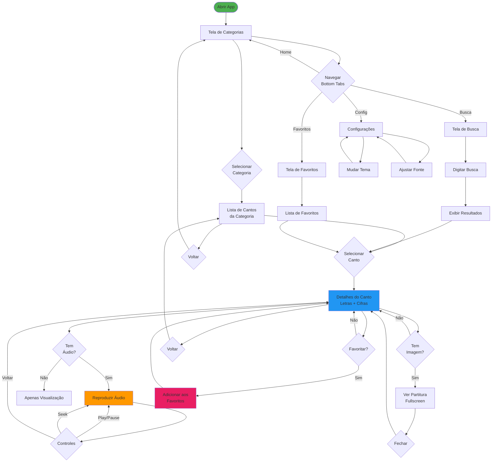

---

## 2. Arquitetura em Camadas

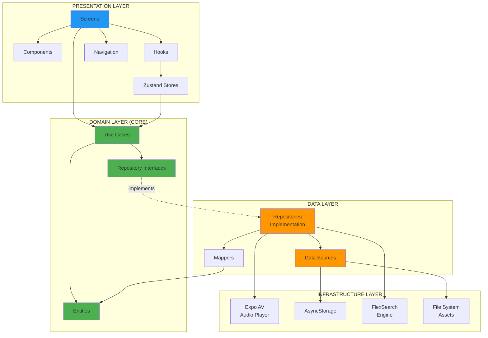

---

## 3. Fluxo de Dados (Get Song Details)

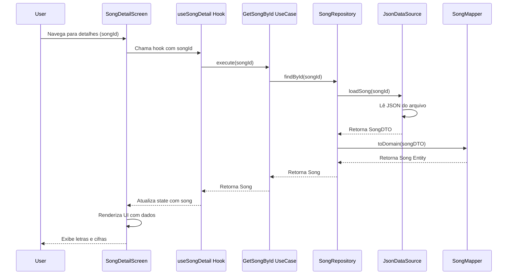

---

## 4. Fluxo de Áudio (Play/Pause)

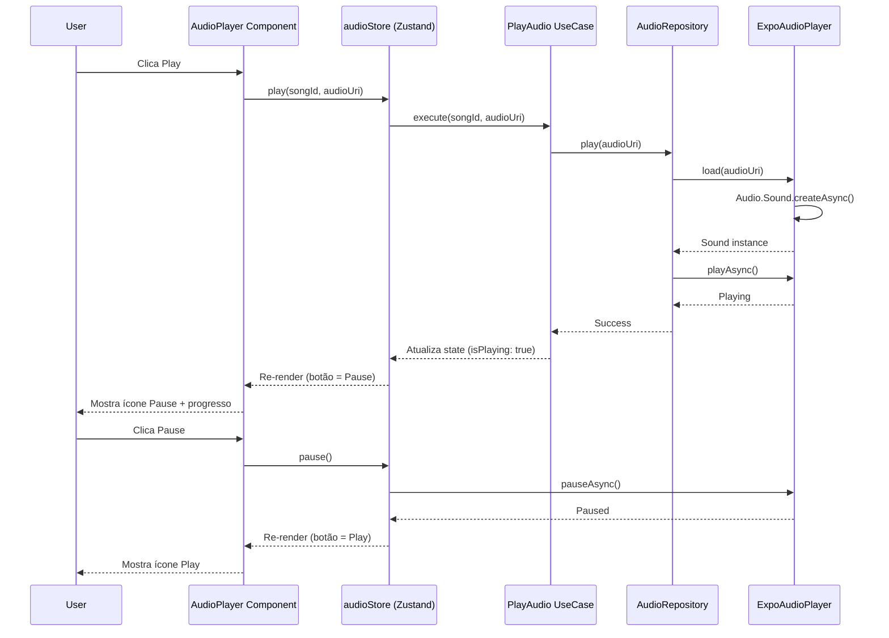

---

## 5. Sistema de Favoritos

```mermaid
flowchart TD
    A[Usuário clica<br/>Botão Favoritar] --> B{Já é<br/>favorito?}
    
    B -->|Sim| C[Remove dos Favoritos]
    B -->|Não| D[Adiciona aos Favoritos]
    
    C --> E[favoritesStore.toggle]
    D --> E
    
    E --> F[ToggleFavorite UseCase]
    F --> G[FavoriteRepository]
    
    G --> H[AsyncStorage]
    H --> I[Persiste JSON<br/>@favorites: string[]]
    
    I --> J[Atualiza Store State]
    J --> K[Re-render UI]
    
    K --> L{Favorito<br/>Ativo?}
    L -->|Sim| M[Ícone Coração Cheio<br/>Cor Vermelha]
    L -->|Não| N[Ícone Coração Vazio<br/>Cor Cinza]
    
    M --> O[Aparece na<br/>Tela de Favoritos]
    N --> P[Não aparece na<br/>Tela de Favoritos]
    
    style A fill:#2196F3
    style M fill:#E91E63
    style O fill:#E91E63
```

---

## 6. Sistema de Busca

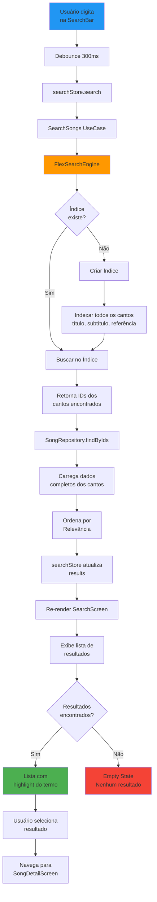

---

## 7. Estrutura de Componentes (SongDetailScreen)

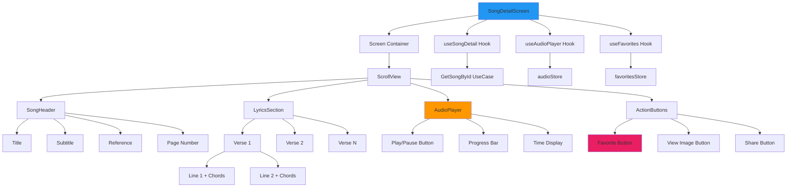

---

## 8. Ciclo de Vida do Player de Áudio

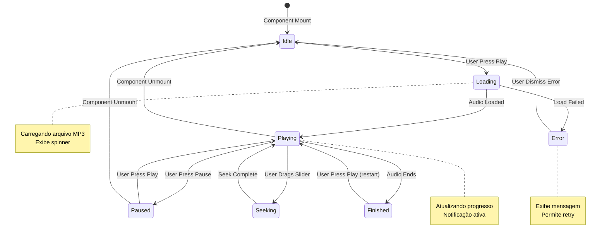

---

## 9. Fluxo de Build e Deploy

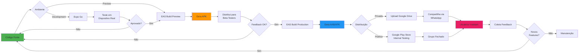

---

## 10. Estratégia de Cache

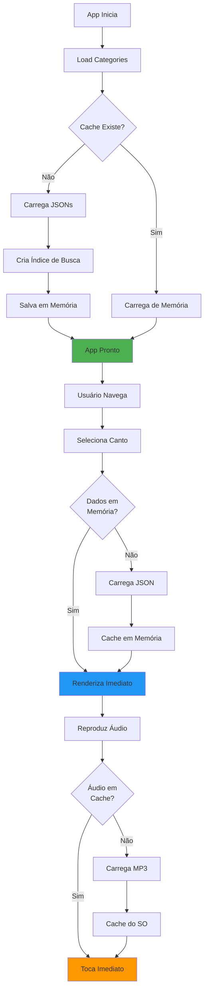

---

## 11. Estrutura de Testes

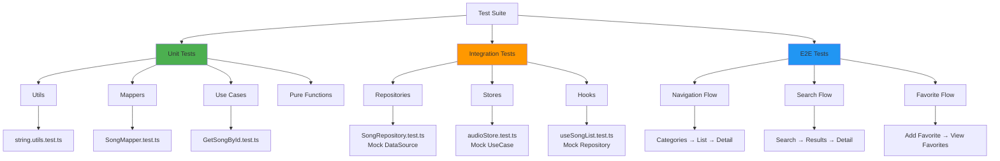

---

## 12. Modelo de Dados (Entidades)

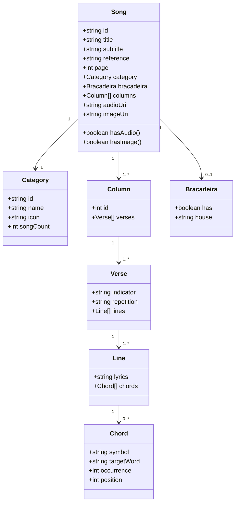

---

## 13. Fluxo de Tratamento de Erros

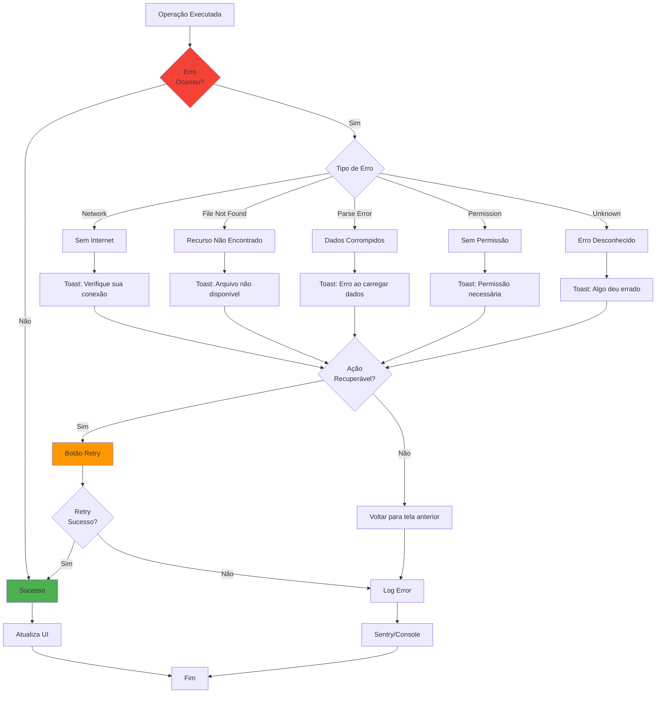

---

## 14. Navegação (Stack & Tabs)

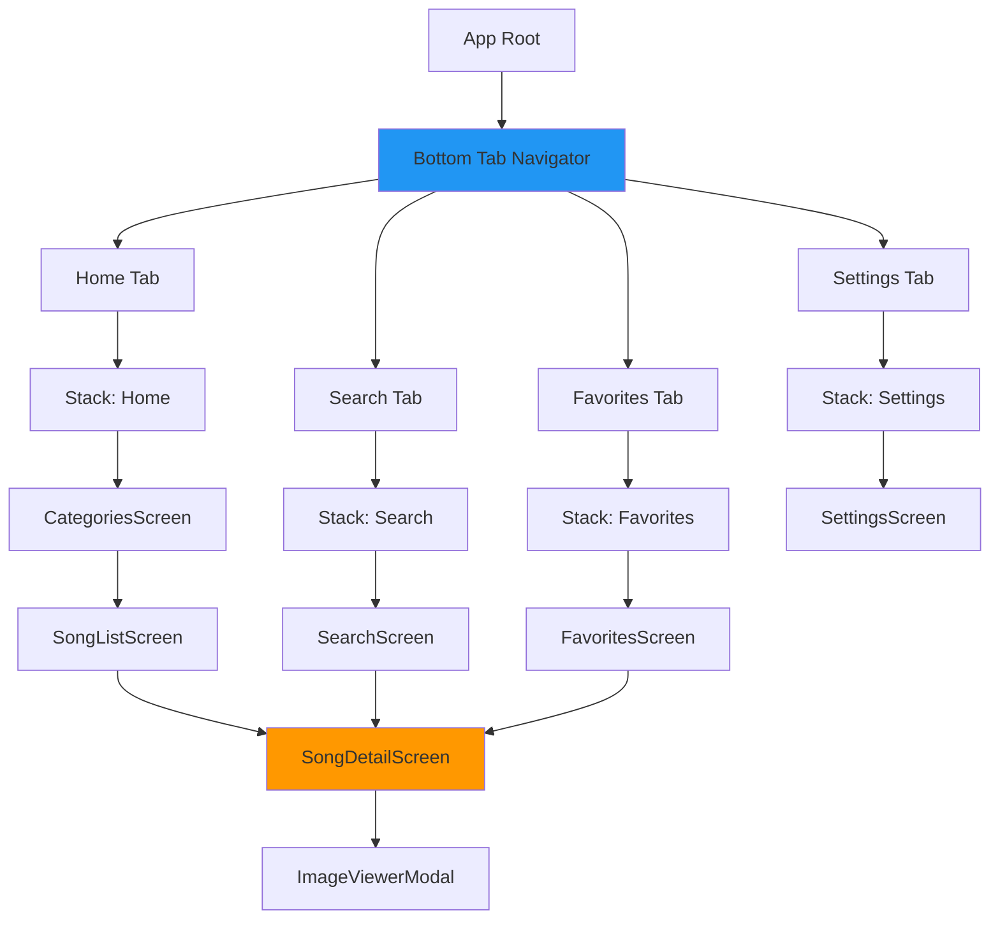

---

## Legendas

### Cores dos Diagramas

- 🟢 **Verde (#4CAF50):** Sucesso, Estado Final, Entidades
- 🔵 **Azul (#2196F3):** Telas, Apresentação, Navegação
- 🟠 **Laranja (#FF9800):** Processamento, Dados, Middleware
- 🔴 **Vermelho (#F44336):** Erros, Estados Negativos
- 💗 **Rosa (#E91E63):** Favoritos, Ações do Usuário

---

**Versão:** 1.0  
**Última Atualização:** Outubro 2025  
**Ferramentas:** Mermaid.js  
**Próxima Revisão:** Durante desenvolvimento (atualizar conforme implementação)
